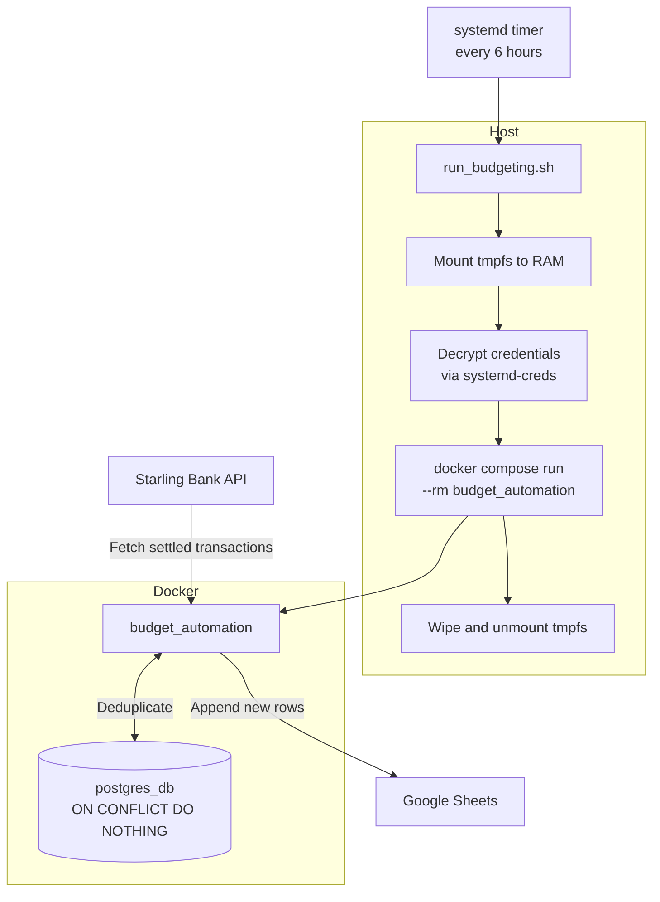

# budget-automation

[](https://github.com/mojarsh/budget-automation/actions/workflows/ci.yml)
[](https://codecov.io/gh/mojarsh/budget-automation)
[](https://www.python.org/downloads/)
[](https://github.com/astral-sh/ruff)

Automated pipeline that pulls settled transactions from the [Starling Bank API](https://developer.starlingbank.com/docs), deduplicates via PostgreSQL, and writes new rows to a Google Sheet. Runs on a self-hosted server via a systemd timer.

---

## Architecture



---

## Tech stack

| Concern | Tool |
|---|---|
| Language | Python 3.14 |
| Dependency management | [uv](https://github.com/astral-sh/uv) |
| Configuration | [pydantic-settings](https://docs.pydantic.dev/latest/concepts/pydantic_settings/) |
| Database | PostgreSQL 17 via SQLAlchemy |
| Sheets API | [gspread](https://github.com/burnash/gspread) |
| Containerisation | Docker / Docker Compose |
| Secret management | systemd-creds (TPM-bound encryption) |
| Scheduling | systemd timer |
| Linting | Ruff |
| Type checking | mypy |
| Security scanning | bandit |
| CI/CD | GitHub Actions + GHCR |

---

## Project structure

```
budget-automation/
├── .github/workflows/
│   ├── ci.yml              # ruff, mypy, bandit, pytest on every push
│   └── cd.yml              # build and push to GHCR on main merge
├── config/
│   ├── category_mapping.json   # maps Starling categories to sheet categories
│   └── logging_config.json     # logging configuration
├── infra/
│   ├── systemd/            # service and timer unit files
│   ├── sudoers/            # sudoers rules for budget-automation group
│   ├── run_budgeting.sh    # entrypoint invoked by systemd
│   └── README.md           # host setup instructions
├── src/budget_automation/
│   ├── config.py           # pydantic-settings configuration
│   ├── database.py         # SQLAlchemy upsert
│   ├── logger.py           # structured logging
│   ├── sheets.py           # Google Sheets writer
│   └── starling.py         # Starling API client and transforms
├── tests/
├── docker-compose.yml
├── Dockerfile
└── pyproject.toml
```

---

## Secret management

Credentials are never written to disk in plaintext. At runtime, `run_budgeting.sh` mounts a 1MB RAM-only tmpfs, decrypts credentials into it using `systemd-creds`, and passes the directory to the container as an environment file. The tmpfs is wiped and unmounted immediately after the container exits.

The `.env` file and Google credentials JSON are encrypted at rest using `systemd-creds`, which binds the encryption to the host machine's TPM or machine key. The encrypted `.cred` files are safe to store on disk and are not portable between machines by design.

---

## CI/CD

Every push to any branch runs the full quality gate:

```
ruff format --check → ruff check → mypy → bandit → pytest --cov
```

Merges to `main` trigger a Docker build and push to [GHCR](https://github.com/mojarsh/budget-automation/pkgs/container/budget-automation). The image is pulled by the host on the next scheduled run.

---

## Deployment

See [`infra/README.md`](infra/README.md) for full host setup instructions including systemd, sudoers, and credential encryption.
